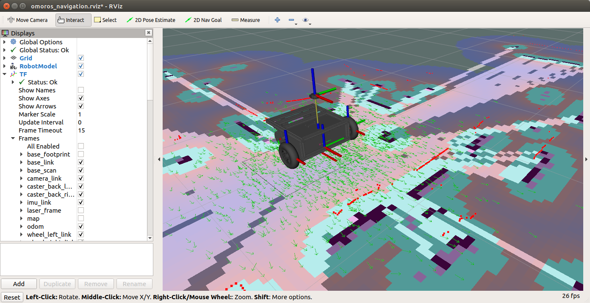
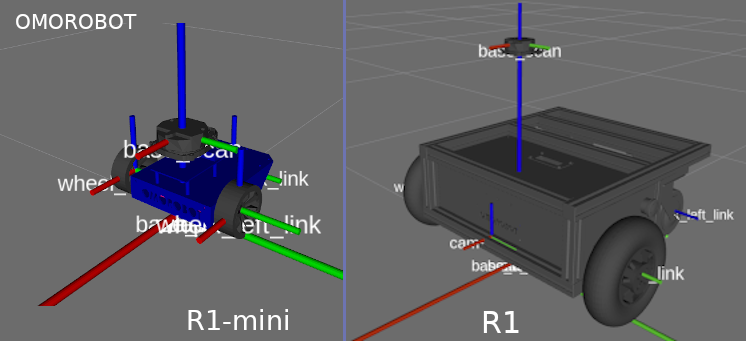
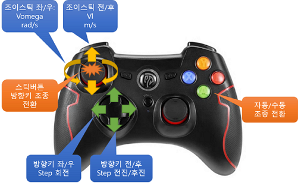
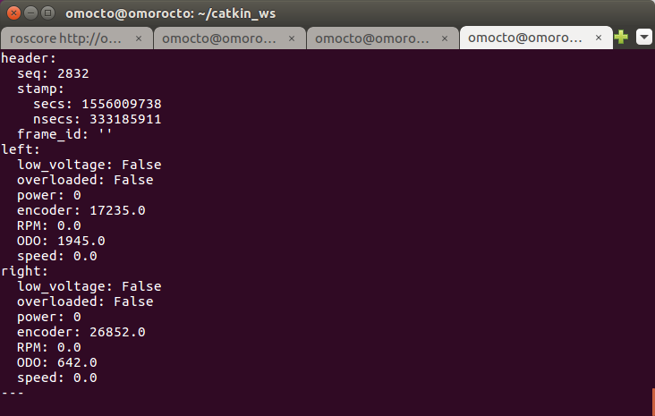
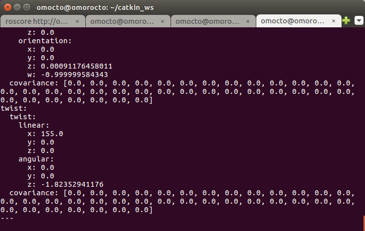

# OMOROS

오모로봇 제품군의 ROS 지원 드라이버 및 네비게이션 패키지 입니다.

이 드라이버를 사용하여 자율주행, 원격 주행에 필요한 엔코더, Odometry정보를 가져오고 주행 명령을 내릴 수 있습니다.

또한 ydlidar등의 거리 측정 센서를 추가하여 SLAM, Mapping을 통해 자율주행을 시작할 수 있습니다.

ROS에서 구현된 SLAM 기능을 활용하기 위해 gmapping 등의 패키지가 필요합니다.
(ROS-Melodic에서 테스트 됨)

<div align="center">
  
</div>

지원 모델: 

- [R1](https://www.omorobot.com/omo-r1)
- [R1-mini](https://www.omorobot.com/omo-r1-mini)

## 개요
- [1. 설치하기](#1-설치하기)
- [2. 사용 방법](#2-사용-방법)
- [3. 문제 해결](#3-문제-해결)
- [4. SLAM Mapping](#4-slam-mapping)

## 1. 설치하기

### 1.1 우분투 리눅스

ROS패키지들이 설치되어있는 ros_catkin_ws/src 에서 git clone하여 소스를 복사합니다.
```
$ cd to catkin_ws/src
$ git clone https://github.com/omorobot/omoros.git
```
이제 catkin_ws에서 catkin_make 하여 패키지를 설치합니다.
```
$ cd ~/catkin_ws
$ catkin_make
```
### 1.2 라즈베리파이에서 실행

raspbian이 설치된 라즈베리파이에서 테스트하였습니다.

로봇을 라즈베리파이에 연결하여 구동하는 경우 아래 설치 과정을 따라 설치 후 진행하시기 바랍니다.

네비게이션 관련 패키지가 필요하므로 Desktop 버전으로 설치하는 것을 권장합니다.

[Installing ROS Kinetic on the Raspberry Pi](http://wiki.ros.org/ROSberryPi/Installing%20ROS%20Kinetic%20on%20the%20Raspberry%20Pi)

** Raspberry Pi용 이미지로부터 굽기**

위 설치과정이 번거롭다면 아래 링크로부터 전체 이미지를 다운로드 하고 etcher와 같은 이미지 쓰기 도구로 microSD에 구워서 사용하여 설치합니다.

라즈베리파이 3용 Raspbian stretch + ROS-kinetic
[Raspian stretch image with ROS-kinetic installed](https://drive.google.com/open?id=1jAGlkIUAB_SLq0WCe1G4SktzwUm7abHW)

라즈베리파이 4용 Raspbian buster + ROS-melodic
[Raspian buter image with ROS-melodic installed](https://drive.google.com/open?id=1D_h7qv17UP1tMLZL60qzBl1sEwGxm00D)

처음 microSD로 부팅한 후에는 터미널에서 raspi-config 를 실행하여 파일시스템을 SD카드 전체로 확장합니다.

<div align="center">

</div>

### 1.3 의존성 패키지 설치하기

드라이버를 구동하기 위해서는 기본적으로 다음과 같은 패키지들이 필요합니다.  
자세한 설치 방법은 아래 링크를 참조하세요.  
라즈베리파이와 같이 ROS를 소스에서 빌드한 시스템의 경우 해당 패키지를 catkin_ws/src/ 에 다운로드 후 catkin_make를 통해 build해야합니다.

* [ROS JOY node](http://wiki.ros.org/joy)  
 joy node 를 설치하기 위해 다음과 같은 패키지들이 필요합니다.

```
$ sudo apt install libusb-dev libbluetooth-dev libcwiid-dev libspnav-dev
```
Joystick이 없는 경우 teleop_twist_keyboard 패키지를 통해 키보드 입력으로 로봇을 구동할 수 있습니다.  
* [ROS teleop_twist_keyboard](http://wiki.ros.org/teleop_twist_keyboard)

* [ROS TF](http://wiki.ros.org/tf)


### 1.4 Serial Port 설정

R1, R1mini는 시리얼 포트를 통해 제어합니다. 다음은 해당 포트를 접근하기 위한 방법을 설명합니다.

먼저 USB to Serial 포트를 PC에 연결하고 시리얼포트의 경로를 확인합니다. 보통 /dev/ttyUSB# 등으로 설정되어있습니다. (라즈베리파이에서 내장 uart 포트인 /dev/ttyS0를 사용하는경우 제외)

복수의 USB to Serial 포트가 연결되어있는 경우 연결 순서에 따라 해당 번호(#)가 바뀌므로 /etc/udev/rules.d 에서 경로를 지정할 필요가 있습니다.

lsusb 명령어를 통해 USB to Serial 포트의 idVendor와 idProduct를 확인합니다.
```
$ lsusb
Bus 001 Device 029: ID 0403:6001 Future Technology Devices International, Ltd FT232 USB-Serial (UART) IC
```
여기에서 ID 뒤에 나온 숫자 앞부분"0403"이 idVendor이고 뒷부분 "6001"이 idProduct입니다.  bringup 폴더로 이동하여 99-omoros.rules 파일을 열고 해당 항목을 수정합니다.
```
SUBSYSTEM=="tty", ATTRS{idVendor}=="0403", ATTRS{idProduct}=="6001", MODE:="0666", GROUP:="dialout", SYMLINK+="ttyMotor"
```
이제 create_udev_rules 스크립트를 실행하여 규칙을 추가하면 항상 /dev/ttyMotor 라는 경로로 고정됩니다.
```
$ ./create_udev_rules
This script copies a udev rule to /etc/udev/rules.d/ to fix serial port path 
to /dev/ttyMotor for omoros driver.


Reload rules
```

## 2. 사용 방법

### 2.1 구동 모듈 driver 실행하기

launch 폴더에는 omoros 실행을 위한 launch 파일들이 존재합니다.

기본적인 로봇 구동을 위해서는 로봇 종류에 따라 drive_r1.launch 혹은 drive_r1mini.launch 파일을 실행하면 됩니다.

R1 로봇을 구동하는 경우 터미널에 다음과 같이 입력합니다.

```
$ roslaunch omoros drive_r1.launch <param>
```

<param> 항목에는 다음과 같은 파라미터를 입력할 수 있습니다.

- set_port:= 시리얼 포트의 경로 (기본 값은 "/dev/ttyMotor" 입니다)
- set_run_rviz:= rviz 실행 여부 (기본 값은 "0" 입니다. rviz를 실행하기 위해서는 1로 설정합니다.)
- set_joy_en:= joystick 입력 여부 (기본 값은 "1" 입니다. 조이스틱을 실행하지 않고 cmd_vel 명령으로 동작하려면 0으로 설정합니다.)

R1-mini 로봇을 구동하는 경우 터미널에 다음과 같이 입력합니다.
```
$ roslaunch omoros drive_r1mini.launch <param>
```

<param> 항목에는 다음과 같은 파라미터를 **추가로** 입력할 수 있습니다.

- set_remote:= 원격 실행 (기본 값은 "1" 입니다. 로컬 머신에서 실행하는 경우 "0"으로 설정합니다)

또는 omoros_core.launch 파일을 열어서 <node pkg="omoros" 항목을 찾아서 내용을 직접 변경하면 됩니다.

**주의** 실행 전에 PC의 Serial port와 로봇의 연결상태를 확인하세요.

시리얼 포트 관련 문제는 [다음](#serial)을 참조 바랍니다.

실행 후 rosrun rviz rviz 명령을 통해 아래 그림과 같이 로봇 모델이 생성되고 조이스틱 명령에 따라 이동하는것을 확인할 수 있습니다.

<div align="center">
  
</div>

### 2.2 원격 PC에서 실행하기

R1-mini 로봇의 경우 로봇의 크기가 제한되어 모니터나 키보드를 장착할 수 없는 경우가 있습니다.  이런 경우 노트북이나 데스크탑을 ROS_MASTER로 지정하고 로봇의 임베디드PC를 원격에서 접속하여 마치 동일한 시스템에서 구동하는 것처럼 실행할 수 있습니다.

#### HOST PC 설정하기

 - HOST PC의 IP주소를 확인합니다.
 - 임베디드 PC와 동일한 버전의 ROS가 설치되어 있는지 확인합니다.

터미널을 열고 다음과 같이 입력합니다.
```
export ROS_MASTER_URI=http://<PC의 IP 주소>:11311
export ROS_IP=<PC의 IP 주소>
```
이제 roslaunch 명령어로 host_r1mini_view.launch를 실행합니다.
```
roslaunch omoros host_r1mini_view.launch
```

#### 로봇 임베디드 PC(타겟) 설정하기

다음 사항을 확인합니다.

 - 타겟은 Host PC와 동일한 라우터로 연결된 망에 접속해 있을것
 - 타겟의 IP 주소를 확인
 - Host PC에서 SSH를 통해 타겟에 접속 가능할 것.

Host PC에서 터미널을 열고 SSH를 통해 타겟에 접속한 후 다음을 입력합니다.
```
export ROS_MASTER_URI=http://<PC의 IP 주소>:11311
export ROS_IP=<로봇의 IP 주소>
```
이제 roslaunch 명령어로 drive_r1mini.launch를 실행합니다.
```
$ roslaunch omoros drive_r1mini.launch
```

### 2.3 조작 방법

로봇의 조작 방법은 아래 그림을 참조하시기 바랍니다.

<div align="center">
  
</div>

 - 기본적인 조작 방법은 스틱을 앞/뒤, 좌/우로 조작하여 움직이는 것입니다.
 - 스틱의 버튼을 누르면 방향키 모드로 전환하여 일정 거리, 각도만큼 움직입니다.
 - 버튼의 A키 혹은 1번 키를 누르면 조이스틱 조종을 해제하고 cmd_vel 메세지의 속도/회전속도 명령으로 동작합니다.
 
조이스틱 조작에서 에러가 발생하는 경우 [다음](#joystick)을 참조 바랍니다.

### 2.4 ROS Topic Messages

이 드라이버는 다음과 같은 메세지들을 Publish 혹은 Subscribe 합니다.
```
$ rostopic list

/cmd_vel
/diagnostics
/joy
/joy/set_feedback
/motor/encoder/left
/motor/encoder/right
/motor/status
/odom
```

R1Command 메세지는 삭제되고 cmd_vel 명령으로 대체되었습니다.

**Subscribed message**

* joy 
  - Axis: Joystick의 스틱 입력을 받아 좌/우 바퀴의 회전 속도를 제어합니다.
  - BUttons: 1번 버튼(A) 입력으로 조이스틱 조종 및 자동주행을 선택합니다.


* cmd_vel
  - http://wiki.ros.org/Robots/TIAGo/Tutorials/motions/cmd_vel
  - cmd.linear.x : 로봇의 종방향 속도 m/s
  - cmd.angular.z : 로봇의 회전 속도 rad/s

**Publish message**

* motor/encoder/left or right: 모터 엔코더의 누적된 카운트를 출력합니다.

* motor/status 
   - 좌/우 모터의 엔코더, RPM, ODO, speed(mm/s)값을 전송합니다.
<div align="center">
  
</div>

* odom: Navigation에 필요한 속도/회전속도, 위치를 전송합니다.
 - "odom" 의 하위 링크는 "base_link" 입니다.
<div align="center">
  
</div>

## 3. 문제 해결

### 3.1 <a name="serial"> Serial Port Error </a>
* 퍼미션 오류: Add user dialout

아래와 같은 메세지가 뜨면서 시리얼 포트를 열 수 없는 경우

[Errno 13] Permission denied: '/dev/ttyUSB0'
사용자 그룹에 dialout을 추가합니다.

'''
$ sudo gpasswd -a UserName dialout
'''

로그아웃 후 재 로그인을 하면 정상적으로 실행됩니다.

* 시리얼 포트를 열 수 없는 경우

시리얼 포트의 경로를 확인합니다.

launch/omoros_core.launch를 열고 다음 코드의 내용을 수정합니다.

```
      <param name="port" value="/dev/ttyMotor"/>
```

Raspberry PI의 내장 시리얼포트를 사용하기 위해서는 경로를 아래와같이 설정합니다.

'/dev/ttyS0'

### 3.2 <a name="joystick"> Joystick index Error </a>

조이스틱의 특정 버튼을 눌렀을때 에러가 발생하거나 조이스틱의 전/후 좌/우가 엉뚱한 스틱으로 지정되어 조작이 어려울 수 있습니다.  
이것은 조이스틱에 따라 axes와 buttons에 할당된 index 번호가 다르기 때문입니다.

**rostopic echo joy** 명령으로 조이스틱에 할당된 axes와 buttons의 index 위치가 바뀌었다면
callbackJoy 함수에서 해당 번호를 수정해야합니다. self.joyAxes[#] 혹은 self.joyButtons[#] 부분
```
---
header: 
  seq: 14
  stamp: 
    secs: 1559113339
    nsecs: 939150960
  frame_id: ''
axes: [0.0, 0.0, 0.0, 0.0, 0.0, 0.0]
buttons: [0, 1, 0, 0, 0, 0, 0, 0, 0, 0, 0, 0, 0]
---
```

## 4. SLAM Mapping

R-1 로봇에 YDLidar와 같은 2D 라이다 센서를 장착하면 SLAM 기술을 적용하여 맵을 생성하고 항법에 적용할 수 있습니다.
OMOROS는 omoros_navigation.launch 파일을 구동하여 ROS의 SLAM 패키지를 활용한 매핑과 네비게이션을 테스트할 수 있는 환경을 제공합니다.

### 4.1 요구사항

 - YDLidar 는 https://smartstore.naver.com/omorobot/products/4445001397 에서 구매할 수 있습니다.
 - ROS는 Desktop-Full 로 설치되어야 합니다. 
 - omoros_navigation.launch 파일을 구동하기 위해서는 다음과 같은 패키지가 필요합니다.

### YDLidar 설치하기

catkin_ws의 src폴더로 이동하여 패키지를 다운로드합니다.
```
$ git clone https://github.com/EAIBOT/ydlidar.git
```
catkin_make 명령으로 패키지를 설치합니다.
```
$ catkin_make --pkg ydlidar
```
startup 폴더로 이동하여 initenv.sh 스크립트를 실행하여 usb 장치를 설치합니다.

자세한 설치 방법은 https://github.com/EAIBOT/ydlidar 를 참조하시기 바랍니다.

### SLAM 관련 ROS 패키지 설치하기

apt 명령어로 다음과 같은 패키지들을 설치합니다.(ROS-Melodic 기준)

```
$ sudo apt install ros-melodic-amcl ros-melodic-gmapping ros-melodic-navigation
```

### 4.2 omoros navigation 실행하기

설치가 완료되면 roslaunch 명령으로 네비게이션 패키지를 실행할 수 있습니다.
#### R1을 직접 연결된 노트 PC에서 구동하는 경우
omoros_navigation 을 실행하면 로컬 PC에서 모든 SLAM 패키지를 구동시킬 수 있습니다.  
로컬 PC의 성능이 충분한 경우 추천됩니다.

```
$ roslaunch omoros omoros_navigation.launch 
```

#### R1mini를 원격 HOST PC에서 구동하는 경우

라즈베리파이같은 저전력 PC의 경우 컴퓨팅 성능이 부족하여 SLAM과 같이 높은 연산 능력이 필요한 프로그램을 실행하기 어려운 경우 로봇 구동과 센서에 관련된 노드만 Robot에서 실행하고 SLAM이나 네비게이션 페키지는 Host PC에서 실행하는 것이 좋습니다.  
자세한 방법은 [2.2 원격 PC에서 실행하기](#22-원격-pc에서-실행하기)를 참조합니다.

먼저 Host PC에서 Navigation 패키지를 구동합니다.
```
$ roslaunch omoros host_r1mini_navigation.launch
```
타겟에 ssh로 접속한 후 다음 명령어를 통해 로봇을 구동합니다.  
ydlidar를 구동하기 위해 set_ydlidar:=1을 추가합니다.
```
$ roslaunch omoros drive_r1mini.launch set_ydlidar:=1
```


Copyright (c) 2019, OMOROBOT Inc.,

